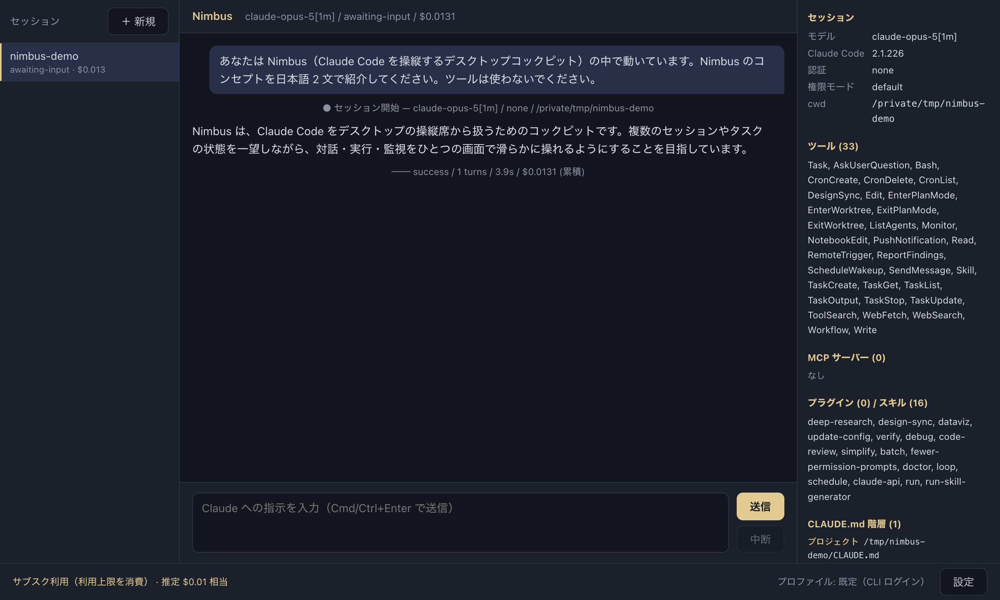
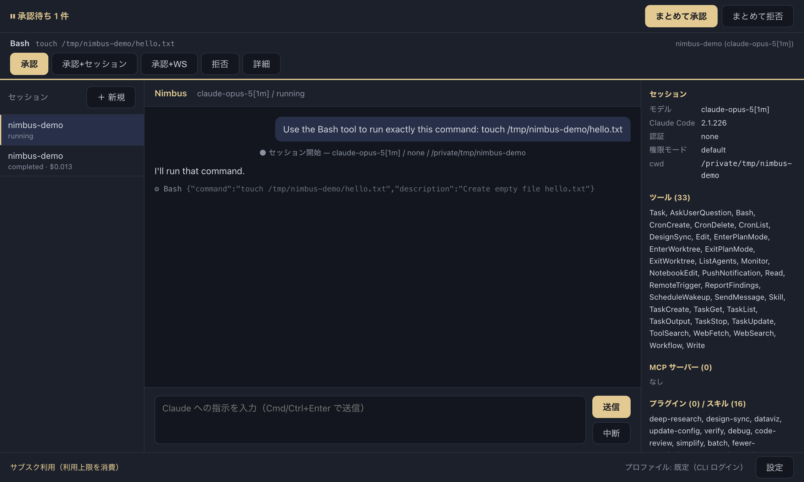

# Nimbus

**A cockpit for piloting Claude Code agents** — not an editor that writes code for you, but a control seat for the loop that actually matters now: _instruct → wait → review → re-instruct_.

**Claude Code を操縦するためのデスクトップコックピット。** 賢い補完エディタではなく、「指示 → 待機 → レビュー → 再指示」のループそのものを磨くための操縦席です。

> ⚠️ **Unofficial**: Nimbus is an independent open-source project. It is **not** an official Anthropic product and is not affiliated with, endorsed by, or supported by Anthropic.
> 本プロダクトは Anthropic の公式製品ではなく、Anthropic とは無関係の非公式ツールです。



_Approval inbox — tool calls held for review before execution:_



## なぜ "Nimbus" なのか

**Nimbus** はラテン語で「雲」を意味する語で、気象学では雨雲を指します
（乱層雲 _nimbostratus_、積乱雲 _cumulonimbus_ など）。
同時に美術の世界では、聖人や神像の頭上に描かれる **光背（後光）** を指す言葉でもあります。

Nimbus が目指すのは、開発者の手からキーボードを奪うことではなく、
**背後からそっと照らす光** であること。
コードを書くのはあなたで、Nimbus はその周りに漂う雲であり、光でありたい。

> 語源についての補足：「Claude」という名前自体はラテン語の人名 _Claudius_ に由来し、
> _cloud_（雲）とは語源的な繋がりはありません。あくまで響きから連想した名前です。

_(EN)_ **Nimbus** is Latin for "cloud" — in meteorology, a rain cloud (as in _nimbostratus_ and _cumulonimbus_). In art, it is also the word for the **halo** painted above saints. Nimbus does not want to take the keyboard away from you; it wants to be **the light that quietly shines from behind**. You write the code — Nimbus is the cloud drifting around it, and the halo. (The name "Claude" itself derives from the Latin name _Claudius_ and has no etymological link to "cloud" — the association is purely by sound.) The default theme follows this origin: rain-cloud blue-gray with a soft halo gold.

## Features (Phase 1)

| Feature                                                                                                                                                                                   | Status |
| ----------------------------------------------------------------------------------------------------------------------------------------------------------------------------------------- | ------ |
| **Session engine** — interactive Claude Code sessions via the Agent SDK: streaming, interrupt, resume, multiple concurrent sessions on the same project                                   | ✅     |
| **Approval inbox** — tool calls held before execution in one cross-session queue; approve/deny individually or in bulk, auto-approve rules per session/workspace, OS notifications        | ✅     |
| **Context visualization** — model, tools, MCP servers, plugins/skills, applied CLAUDE.md hierarchy, cumulative cost + token graphs                                                        | ✅     |
| **Connection settings (BYO Claude Code)** — ride your existing `claude` login, or use an API key / Bedrock / Vertex / Foundry via profiles; billing mode always visible in the status bar | ✅     |
| **Themes** — VS Code-style workbench color keys, 3 built-in themes, `~/.nimbus/themes/*.json` hot reload, OS dark-mode follow, font settings                                              | ✅     |
| **Session persistence** — every event stored locally in SQLite (after secret sanitization), sessions searchable and resumable                                                             | ✅     |
| GUI diff review (Phase 2) / worktree kanban (Phase 3) / config lab (Phase 4)                                                                                                              | 🔜     |

## Getting started

Requirements: **Node.js >= 22**, and a working [Claude Code](https://code.claude.com/) setup (for the default connection mode, log in once with `claude` in your terminal).

```bash
npm install
npm run dev        # launch in development
npm test           # unit tests
npm run typecheck  # TypeScript
npm run lint       # ESLint
```

## Connection & billing / 接続と課金

Nimbus **never implements a login form and never takes custody of your credentials** (§F-7 principle). Choose per profile:

1. **Claude Code login (default)** — uses your existing CLI login as-is. Nimbus does not touch credentials. Usage counts against your Claude subscription limits (current Anthropic policy as of 2026-08; the once-announced separate SDK credit pool is paused).
2. **API key** — pay-per-use via the Claude Console. Keys are encrypted with the OS secure storage (`safeStorage`; Keychain / DPAPI / libsecret). If secure storage is unavailable, Nimbus **refuses to store the key** rather than falling back to plaintext.
3. **Cloud providers** — Amazon Bedrock / Google Cloud / Microsoft Foundry via your own provider credentials.

The status bar always shows which billing mode is active（ステータスバーに「サブスク利用（利用上限を消費）」か「API キー利用（従量課金）」かを常時表示します）. Cost figures shown in Nimbus are client-side estimates, not billing statements.

> Note: Anthropic's policy states that third-party developers may not offer claude.ai login for their products without prior approval. Nimbus does not offer or embed any login; connection mode 1 simply runs on a machine where _you_ have already logged in with the official CLI, and whether that fits your use is your responsibility to evaluate.

## Privacy & security

- All data stays local. **No telemetry, no external transmission.**
- Everything written to the local SQLite log passes a **secret sanitizer** first (API-key patterns, tokens, sensitive env values) so pasting logs into an issue doesn't leak credentials.
- Renderer is fully sandboxed (`sandbox: true`, `contextIsolation: true`, `nodeIntegration: false`); only a typed whitelist API is exposed.

## Themes

Drop a JSON file into `~/.nimbus/themes/` and it appears instantly (hot reload). Color keys follow VS Code's workbench naming (partial compatibility — VS Code theme files are not guaranteed to load as-is):

```jsonc
{
  "name": "My Theme",
  "type": "dark",
  "colors": {
    "editor.background": "#12161f",
    "editor.foreground": "#d6dae3",
    "nimbus.accent": "#e8c98a"
  }
}
```

Built-in: **Nimbus Dark** (default — rain-cloud blue-gray + halo gold), **Nimbus Light** (high thin clouds), **Cumulonimbus** (high contrast).

## Development docs

- Product spec / 開発指示書: [`NIMBUS_SPEC.md`](NIMBUS_SPEC.md)
- Per-step verification checklists: [`docs/testing/`](docs/testing/)
- SDK fact-verification evidence: [`docs/research/`](docs/research/)

## License

[MIT](LICENSE) — © 2026 Idris
